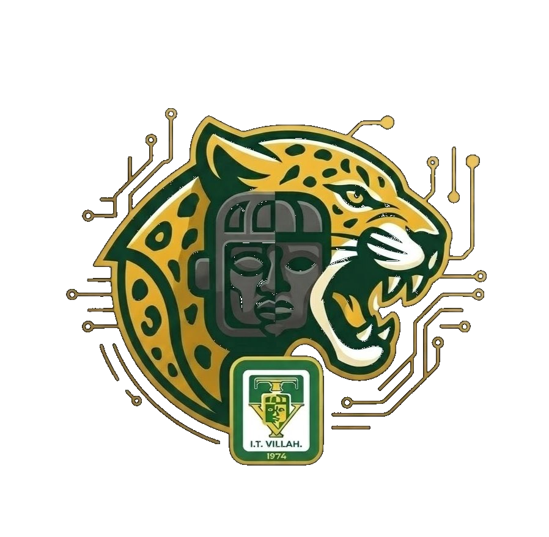

<h1>Comunidad ITVH</h1>

Documentación legal y recursos oficiales de la aplicación <strong>Comunidad ITVH</strong>, 
desarrollada por <strong>Programix NaveJL</strong> para la comunidad estudiantil 
del Instituto Tecnológico de Villahermosa.

---

## 📄 Contenido del repositorio

| Archivo | Descripción |
|---|---|
| `terminos.html` | Términos y Condiciones de Uso — versión web interactiva |
| `docs/` | PDF oficial descargable |
| `imagenes/` | Logotipos e identidad visual |

## 📋 Módulos del documento

1. Registro e Inicio de Sesión
2. Perfil del Usuario
3. Comunidad Tecnológica
4. Marketplace
5. Jaguar Chat
6. UbicaTecNM Campus Villahermosa
7. Propiedad Intelectual
8. Limitación de Responsabilidad
9. Contacto y Medios Oficiales

---

  

© 2026 Programix NaveJL · Todos los derechos reservados 
📧 alfredo.naveju.lop@gmail.com &nbsp;·&nbsp;
🌐 <a href="https://programix-navejl.github.io/programix-navejl">programix-navejl.github.io</a>

